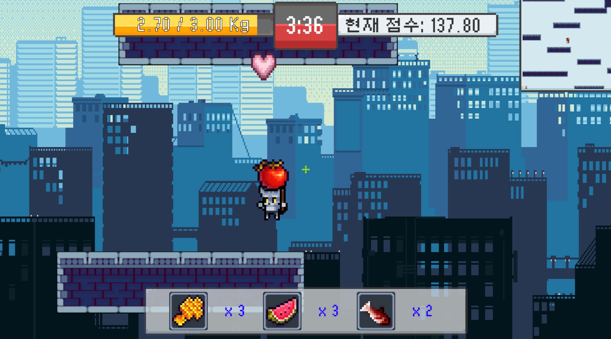
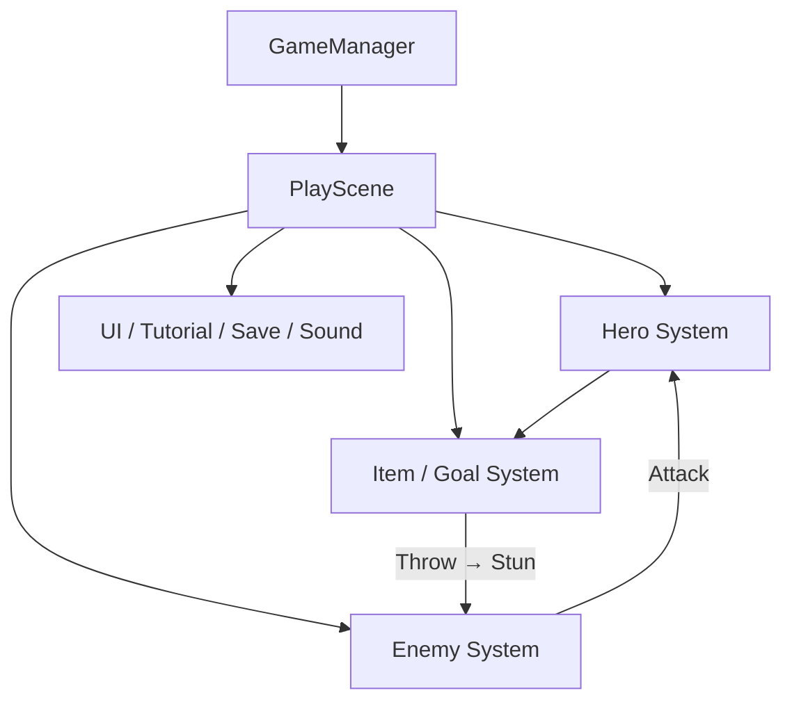
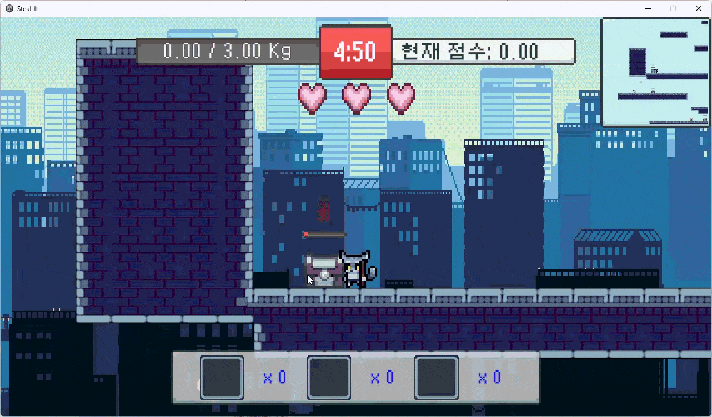
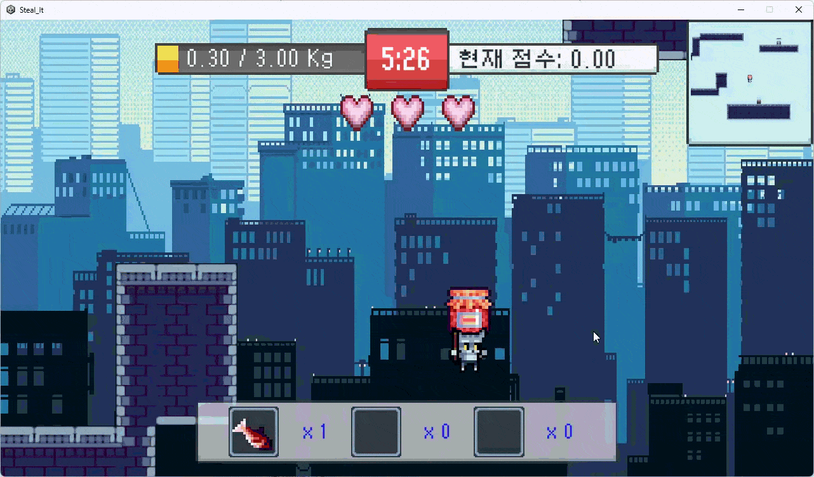
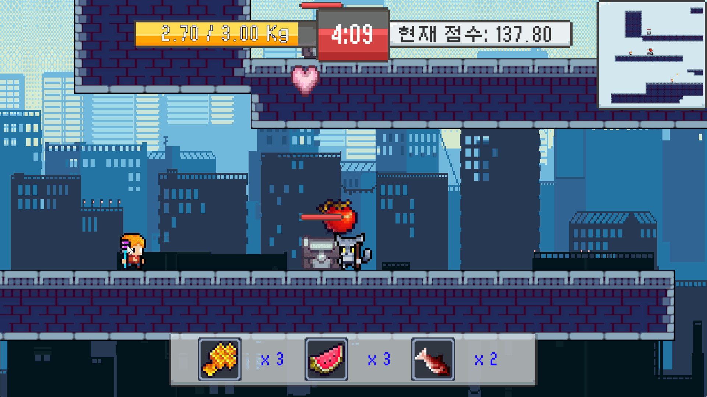
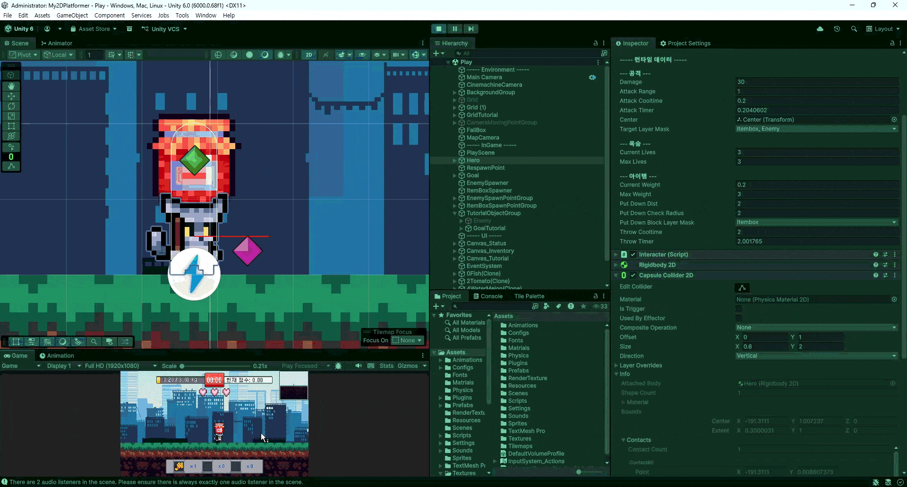

# 훔친다!

제한 시간 안에 맵의 아이템을 훔쳐 목표 지점에 제출하고, 가능한 한 높은 점수를 얻는 **2D 플랫폼 게임**

- **장르**: 2D Platformer / Action
- **엔진**: Unity
- **언어**: C#
- **플랫폼**: PC
- **개발 형태**: 개인 프로젝트
- **개발 기간**: 약 2주 (2026.06.30 ~ 2026.07.13)



[플레이 영상](https://youtu.be/zjg-XjJa4Sc) · [Build](https://drive.google.com/file/d/16eQS8gzSsbNETyxpEZl2zQm__nBiHfQ5/view?usp=sharing)

---

## 1. 프로젝트 개요

### 게임 소개

**훔친다!**는 제한 시간 동안 맵을 이동하며 아이템을 획득하고, 목표 지점에 제출해 점수를 쌓는 2D 플랫폼 게임입니다.  
플레이어는 최대 무게 제한 때문에 모든 아이템을 한 번에 가져갈 수 없으며, 적의 공격을 피하면서 아이템을 운반해야 합니다. 직접 들고 이동하는 아이템은 내려놓거나 던질 수 있고, 던진 아이템으로 적을 일정 시간 스턴시켜 이동 동선을 확보할 수 있습니다.

### 전체 플레이 흐름

```text
맵 탐색
   ↓
아이템 발견
   ↓
획득 / 직접 운반
   ↓
적 공격 회피 또는 아이템 투척으로 스턴
   ↓
Goal 이동
   ↓
아이템 제출 / 점수 획득
   ↓
남은 시간 동안 반복
   ↓
결과 확인
```

### 주요 구현

- 무게 제한 기반 Inventory 아이템 수집
- 직접 운반 아이템의 들기 / 내려놓기 / 던지기 / 제출
- State Pattern 기반 Enemy 행동 관리
- 던진 아이템과 Enemy Stun 연계
- 운반 중 아이템 크기를 반영한 Hero Collider 동적 확장

### 전체 게임 아키텍처

`PlayScene`이 플레이 세션의 중심에서 Hero, Goal, Spawner, Tutorial, UI 이벤트를 연결하며, 아이템 획득 → 운반 → 제출 → 점수 누적 → 결과 저장 흐름을 관리합니다.



---

## 2. 핵심 구현

### 2-1. 아이템 획득 / 운반 / 제출 시스템





아이템은 단순 점수 오브젝트가 아니라 **Inventory 방식과 직접 운반 방식**으로 나누어 상호작용하도록 구성했습니다.

```text
Item
 ├─ CarryType.Inventory
 │      ↓
 │   Inventory 추가
 │      ↓
 │   무게 누적
 │
 └─ CarryType.Interact
        ↓
     직접 들기
        ↓
  내려놓기 / 던지기 / 제출
```

#### 무게 제한 Inventory

`HeroModel`에서 현재 무게와 최대 무게를 관리하고, 아이템 추가 전에 최대 무게 초과 여부를 검사합니다.

**`HeroModel.cs`**

```csharp
public bool AddItem ( ItemData data )
{
    //최대 무게를 넘으면 종료
    if ( _currentWeight + data.Weight > _maxWeight ) return false;

    if ( _inventory.ContainsKey( data ) == false )
    {
        _inventory [ data ] = 1;
    }
    else
    {
        _inventory [ data ]++;
    }

    //현재 무게 갱신
    _currentWeight += data.Weight;

    return true;
}
```

한 번에 모든 아이템을 가져갈 수 없도록 무게 제한을 두어, **어떤 아이템을 먼저 가져갈지 판단하고 Goal까지 왕복하는 플레이**가 발생하도록 했습니다.

#### 아이템 타입에 따른 상호작용 분기

**`Hero.cs`**

```csharp
public bool InteractWithItem ()
{
    Item item = _interacter.FindItem( );

    if ( item == null ) return false;

    if ( item.CarryType == CarryType.Inventory )
    {
        if ( _model.AddItem( item.ItemData ) == true )
        {
            OnWeightChanged?.Invoke(
                _model.CurrentWeight, _model.MaxWeight );

            OnInventoryChanged?.Invoke( _model.Inventory );
            OnItemCollected?.Invoke( );
            item.RemoveItem( );
        }

        return true;
    }

    if ( item.CarryType == CarryType.Interact )
    {
        return _interacter.HoldItem( item );
    }

    return false;
}
```

아이템 데이터의 `CarryType`에 따라 Inventory 수집과 직접 운반을 같은 상호작용 입력에서 분기하도록 구성했습니다.

#### 직접 운반 아이템

`Interacter`는 가까운 아이템 탐색, 들기, 내려놓기, 던지기, Goal 제출 요청을 담당하고, `InteractableItem`은 실제 Rigidbody와 Collider 상태를 변경합니다.

아이템을 들면 Hold Point의 자식으로 이동시키고 중력과 물리 시뮬레이션을 비활성화하며, 내려놓거나 던질 때 다시 물리 상태를 복구합니다.

---

### 2-2. State Pattern 기반 Enemy AI

적의 행동을 하나의 Update 분기문에 모두 넣지 않고, **Normal / Chase / Stun / Attack** 상태를 `IEnemyState` 구현으로 분리했습니다.

**`EnemyState.cs`**

```csharp
public interface IEnemyState
{
    EnemyStateType StateType { get; }

    void Enter ( );
    void Update ( );
    void Exit ( );
}
```

`Enemy.Init()`에서 각 상태 객체를 생성한 뒤 기본 상태인 Normal로 시작합니다.

```text
Normal
 ├─ 일정 시간 경과 → Attack
 └─ 조건 충족 → Chase

Chase
 ├─ 목표 이탈 → Normal
 ├─ 추격 시간 종료 → Normal
 └─ 플레이어 접촉 → 아이템 몰수 → Normal

Stun
 └─ 스턴 시간 종료 → Normal

Attack
 └─ 투사체 공격 → Normal
```

#### 결과

- 행동별 진입 / 유지 / 종료 로직을 상태 단위로 분리
- 추격 / 공격 / 스턴 로직 수정 시 다른 상태의 코드 영향 감소
- 던진 아이템과 Enemy Stun을 상태 전환으로 자연스럽게 연결

---

### 2-3. 아이템 던지기와 Enemy Stun 연계



직접 운반 아이템은 Goal에 제출하는 것 외에도 **적을 잠시 무력화하는 도구**로 사용할 수 있습니다.

#### 무게에 따른 던지기 속도

**`InteractableItem.cs`**

```csharp
public float GetThrowSpeed ()
{
    //무게가 커질수록 던지기 속도 감소
    float throwSpeed =
        _maxThrowSpeed - ItemWeight * _throwWeightRatio;

    return Mathf.Clamp(
        throwSpeed,
        _minThrowSpeed,
        _maxThrowSpeed );
}
```

던진 아이템이 적에게 적중하면 Stun 상태로 전환되고, 스턴 종료 후 다시 Normal 상태로 복귀하도록 연결했습니다.

---

## 3. 트러블슈팅

### 직접 운반 아이템이 지형을 통과하는 문제

#### 문제 상황

직접 운반 아이템을 들면 아이템을 Hero의 Hold Point에 고정하고 물리 시뮬레이션을 비활성화했습니다.  
그 결과 화면상 플레이어의 높이는 **Hero + Item**으로 커졌지만 실제 지형 충돌은 기존 Hero Collider만 사용해, 큰 아이템을 들고 낮은 천장이나 발판 아래를 이동할 때 아이템이 지형과 겹치거나 통과하는 문제가 발생했습니다.

#### 원인

아이템 자체의 Rigidbody를 활성화한 상태로 Hero와 함께 이동시키면 별도의 물리 반응 때문에 운반 동작이 불안정해질 수 있어, 아이템을 들고 있는 동안에는 `Rigidbody2D.simulated = false`로 처리했습니다.

하지만 이 방식에서는 **들고 있는 아이템의 크기가 Hero의 이동 충돌 범위에 포함되지 않는 것**이 문제였습니다.

#### 해결



아이템을 들 때 해당 아이템 Collider의 높이를 구해 Hero의 `CapsuleCollider2D`를 위쪽으로 확장하고, 아이템을 손에서 놓으면 원래 크기로 복구하도록 변경했습니다.

`Hero.Init()`에서 원본 Collider 크기와 Offset을 저장하고, `Interacter`의 들기 / 해제 이벤트에 확장과 복구 함수를 연결했습니다.

**`Hero.cs`**

```csharp
void ExpandColliderByItem ( Item item )
{
    CapsuleCollider2D collider = _collider as CapsuleCollider2D;
    float itemHeight = item.Collider.bounds.size.y;

    Vector2 size = _originColliderSize;
    size.y += itemHeight;

    Vector2 offset = _originColliderOffset;
    offset.y += itemHeight * 0.5f;

    collider.size = size;
    collider.offset = offset;
}

void RestoreCollider ()
{
    CapsuleCollider2D collider = _collider as CapsuleCollider2D;
    collider.size = _originColliderSize;
    collider.offset = _originColliderOffset;
}
```

#### 결과

큰 아이템을 들고 이동할 때 아이템이 지형을 통과하는 현상을 줄이고, 플레이어가 실제로 차지하는 공간과 충돌 범위를 일치시켰습니다.

#### 배운 점

캐릭터에 물체를 종속시켜 이동시키는 경우 개별 오브젝트의 Collider만 볼 것이 아니라, **플레이어가 현재 실제로 차지하는 전체 공간을 기준으로 충돌 범위를 설계해야 한다**는 점을 배웠습니다.

---

## 4. 기타 구현

- **시간 / 점수 시스템**: 제한 시간 동안 목표 점수 없이 가능한 한 높은 점수를 획득하는 방식.
- **Goal 제출**: Inventory 아이템과 직접 운반 아이템을 각각 제출 가능.
- **Square 당기기**: Hero는 입력과 방향 판단, Interacter는 요청 중재, InteractableItem은 무게 기반 이동 시간과 실제 이동을 담당.
- **저장 / 기록**: 최고 점수, 플레이 기록, 누적 아이템 및 적 스턴 수, 튜토리얼 완료 여부 등을 JSON으로 저장.
- **첫 플레이 튜토리얼**: 최초 플레이 시 기본 조작과 핵심 상호작용 안내.
- **UI 피드백 연출**: 점수, 무게, 결과 화면 변화에 짧은 DOTween 연출을 적용.
- **미니맵 UI**: 맵 구조를 한눈에 파악하기 어려운 문제를 보완하기 위해 미니맵을 추가.

---

## 5. 외부 리소스

프로젝트에 사용한 외부 에셋 출처입니다.

| 에셋 | 제작자 |
|---|---|
| FREE RPG Pixel Art Chests w/Animation - Asset Pack | Serial |
| Free Pixel Art Health Hearts 16x16 | Redreeh |
| Pixel Keyboard Keys - for UI | Dream Mix |
| Clock Pixel Art | Bont |
| Free City Backgrounds Pixel Art | CraftPix |
| Undead Survivor Assets Pack | Goldmetal Studio |
| Pixel Hero Maker | Hippo |
| Platformer Tileset - Pixel Art Grasslands | BigManJD |

---

## 6. 개발 회고

### 가장 어려웠던 점

가장 오래 고민했던 문제는 **직접 운반 아이템을 든 상태에서 점프할 때 상단 지형과 충돌하지 않는 문제**였습니다.

처음에는 아이템 자체를 제어하는 방향으로 접근했지만, 실제 원인은 Hero가 시각적으로 차지하는 공간과 Collider 범위가 달라진 데 있었습니다. 들고 있는 아이템 높이만큼 Hero Collider를 확장해 해결하면서, 개별 충돌보다 **현재 행위자의 상태와 실제 충돌 범위가 어떻게 달라졌는지 먼저 확인하는 관점**이 중요하다는 점을 배웠습니다.

### 잘한 점

Enemy AI에 State Pattern을 적용해 `Normal / Chase / Attack / Stun`의 진입 / 실행 / 종료 로직을 분리했습니다. 덕분에 `Enemy`와 `EnemyModel`에 모든 행동 로직이 누적되는 것을 줄이고 상태별 동작을 독립적으로 확인할 수 있었습니다.

또한 2주라는 짧은 기간 안에서 **게임 진행에 필요한 핵심 기능을 먼저 구현한 뒤 부가 기능을 추가하는 방식**으로 범위를 관리했습니다.

### 아쉬운 점

Enemy에는 계획했던 **의심 상태와 같은 중간 행동 상태**까지 확장하지 못했습니다. 아이템 상호작용과 충돌 등 핵심 로직을 우선하면서 제외한 기능입니다.

당시에는 기능 구현을 먼저 진행한 뒤 개발 중간부터 Hero와 Interacter의 책임을 분리하기 시작해, 일부 상호작용 기능의 책임 범위가 넓게 남았습니다.

이 프로젝트 이후에는 입력, 상태, 행동의 책임을 구현 전에 먼저 구분하고, 상태 전환이나 상호작용처럼 독립적으로 변화할 가능성이 높은 기능은 별도의 객체와 구조로 분리하는 방식으로 설계하고 있습니다.

다시 개발한다면 처음부터 각 객체의 책임과 상태 전환 구조를 먼저 정의한 뒤 구현하여, 기능이 추가되더라도 기존 클래스의 책임이 과도하게 확장되지 않도록 구성할 것입니다.

### 다시 개발한다면

특정 상황을 해결하기 위한 기능부터 추가하기보다 먼저 **현재 어떤 객체의 상태가 변했는가**를 기준으로 문제를 바라보고 싶습니다. 운반 아이템 충돌 문제에서도 아이템 자체보다 **아이템을 든 Hero의 충돌 상태가 변한 것**으로 보는 것이 더 단순한 해결책으로 이어졌습니다.

핵심 기능 우선 구현 방식은 유지하되, 초기 단계에서 필수 기능과 확장 기능을 더 명확히 나누고 Enemy 추가 상태나 상호작용 모듈화처럼 후순위 기능의 우선순위까지 미리 정리하고 싶습니다.

---

### README 이미지 파일

```text
Docs/Images/
├─ cover.png
├─ item_get.gif
├─ item_submit.gif
├─ collider.gif
└─ stun.gif
```
